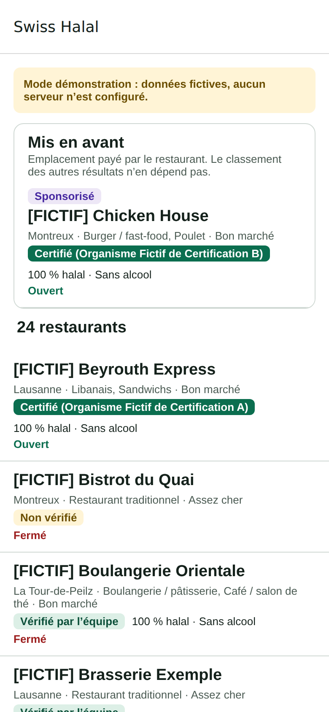
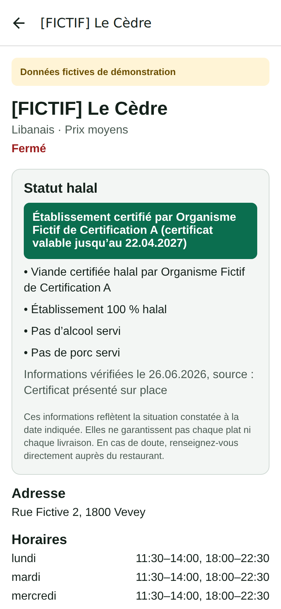
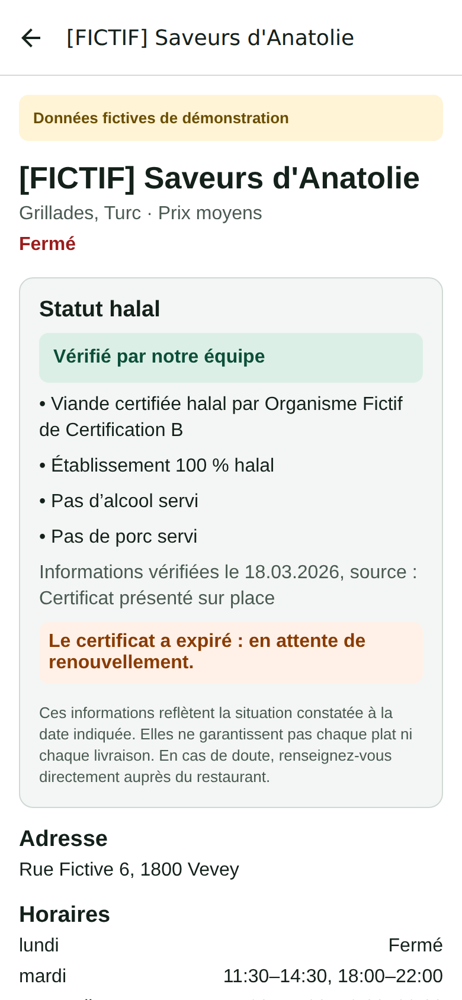
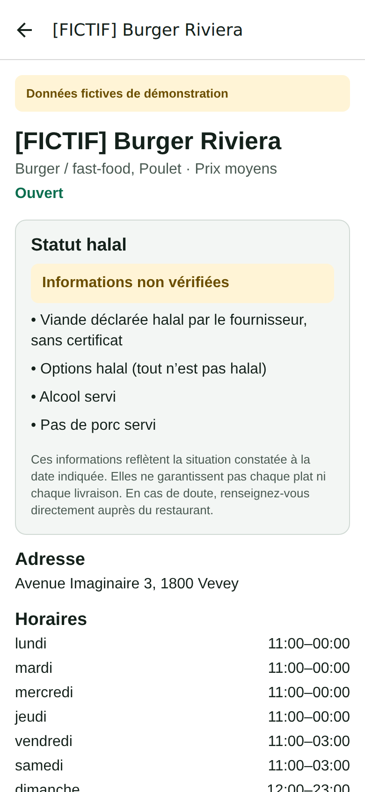

# Phase 1 — Fondations : rapport

Date : 04.10.2026 · Branche : `halal-romandie`

## Ce qui a été fait

| Élément             | Contenu                                                                                                                                                                                                                                                         |
| ------------------- | --------------------------------------------------------------------------------------------------------------------------------------------------------------------------------------------------------------------------------------------------------------- |
| Monorepo            | pnpm + Turborepo, TypeScript strict, ESLint, Prettier, CI GitHub Actions (lint, types, tests, tests de la base, recherche de secrets)                                                                                                                           |
| `packages/core`     | Statut halal (libellés, rétrogradation automatique si certificat expiré ou revérification en retard), horaires (« ouvert maintenant » en heure suisse), classement organique, résultats sponsorisés séparés, filtres combinables, distances, prix en CHF et TVA |
| `packages/i18n`     | 5 langues prêtes (fr rempli, en/ar/es/de retombent sur le français), arabe de droite à gauche, validation ICU                                                                                                                                                   |
| Base de données     | 34 tables, RLS sur toutes, déclencheurs d'intégrité, journal d'audit, vue `restaurant_cards`, stockage photos (public) et preuves (privé)                                                                                                                       |
| Données de test     | 25 restaurants **[FICTIF]** (Vevey, Montreux, La Tour-de-Peilz, Lausanne, dont 1 brouillon), 2 organismes de certification inventés, offres et prix configurables, 2 emplacements sponsorisés                                                                   |
| `packages/supabase` | Lecture et **validation** des données, mode démonstration sans serveur                                                                                                                                                                                          |
| App mobile          | Liste (section « Mis en avant » séparée et étiquetée, puis liste organique) et fiche restaurant (bloc statut halal complet, adresse, horaires)                                                                                                                  |
| Documentation       | README (lancer le projet de zéro), architecture, journal des décisions, matrice des obligations légales                                                                                                                                                         |

## Résultats des vérifications

| Vérification                                              | Résultat                                                                  |
| --------------------------------------------------------- | ------------------------------------------------------------------------- |
| Tests logique métier (`packages/core`)                    | ✅ 47 tests, dont 3 888 combinaisons « jamais certifié sans source »      |
| Tests traductions (`packages/i18n`)                       | ✅ 14 tests                                                               |
| Tests données (`packages/supabase`)                       | ✅ 6 tests (sur les vraies lignes exportées de la base)                   |
| Tests contrastes de couleurs (`apps/mobile`)              | ✅ 31 tests, toutes les couleurs ≥ 4,5:1 (WCAG AA), modes clair et sombre |
| Tests base de données (pgTAP)                             | ✅ 70 tests : RLS, intégrité halal, avis, paiements                       |
| Lint, types, formatage                                    | ✅                                                                        |
| Compilation de l'app (bundle Android Hermes + aperçu web) | ✅                                                                        |
| `expo-doctor`                                             | ✅ 21/21                                                                  |

**Les tests protègent vraiment les règles** : en retirant volontairement une protection (par exemple le déclencheur qui réserve le statut halal aux admins, ou en ajoutant un « boost » Premium dans le classement), les tests concernés échouent.

**Un test a trouvé une vraie faille pendant le développement** : la vue `restaurant_cards` héritait des droits d'écriture que Supabase donne par défaut aux visiteurs. C'est corrigé, et les nouvelles tables ne recevront plus ces droits automatiquement.

> Note technique : Docker n'est pas disponible dans mon environnement. Les tests de la base ont tourné sur un PostgreSQL 16 + PostGIS + pgTAP local, avec une imitation minimale de Supabase (rôles, `auth`, `storage`). La CI GitHub les relancera sur un vrai Supabase local (PostgreSQL 17).

## Captures d'écran (aperçu, données fictives)

| Liste                  | Restaurant certifié                | Certificat expiré                                    | Non vérifié                              |
| ---------------------- | ---------------------------------- | ---------------------------------------------------- | ---------------------------------------- |
|  |  |  |  |

Ce que montrent ces écrans :

- le résultat **sponsorisé** est dans une section séparée, avec l'étiquette « Sponsorisé » et une explication ; il reste aussi à sa place normale dans la liste ;
- le badge « Certifié » nomme toujours l'organisme ;
- un certificat **expiré** fait redescendre automatiquement au niveau « Vérifié par notre équipe », avec un avertissement ;
- l'avertissement sur les limites de la vérification est toujours affiché.

## Pas encore fait (prévu)

- Carte, géolocalisation, recherche et filtres à l'écran, photos, carte et prix, appel et itinéraire → **phase 2**.
- Pour un restaurant « non vérifié », indiquer la source déclarative (« informations déclarées par… ») → phase 2.
- Back-office admin et fiches web → selon la décision D10 (site web).
- Comptes, avis à l'écran, export et suppression de compte → phase 3.

## Ce que tu peux faire maintenant

1. Essayer l'app : `pnpm install` puis `pnpm dev:mobile`, et scanner le QR code avec Expo Go (voir README).
2. Répondre aux questions en attente : site web (D10), région Supabase (D3), et valider les décisions « proposées » de `docs/DECISIONS.md`.
