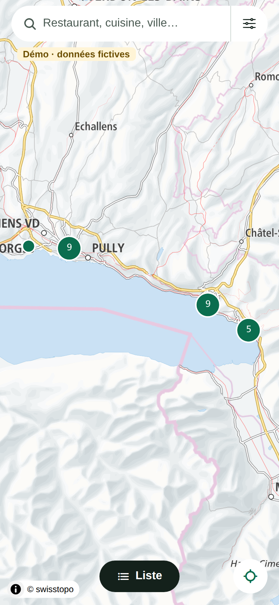
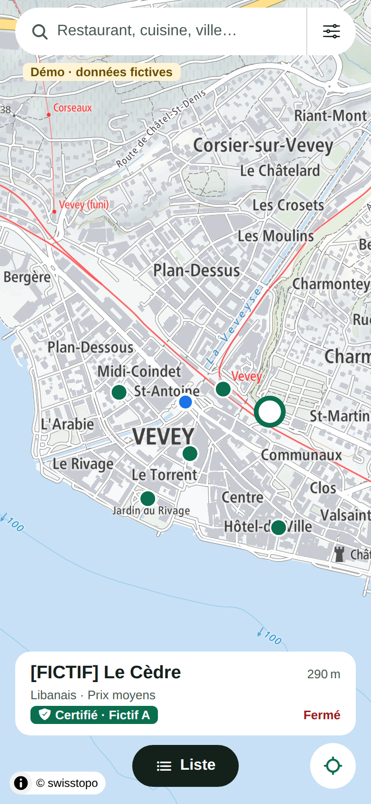
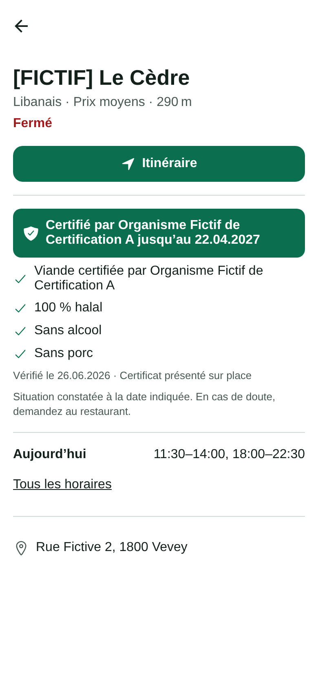
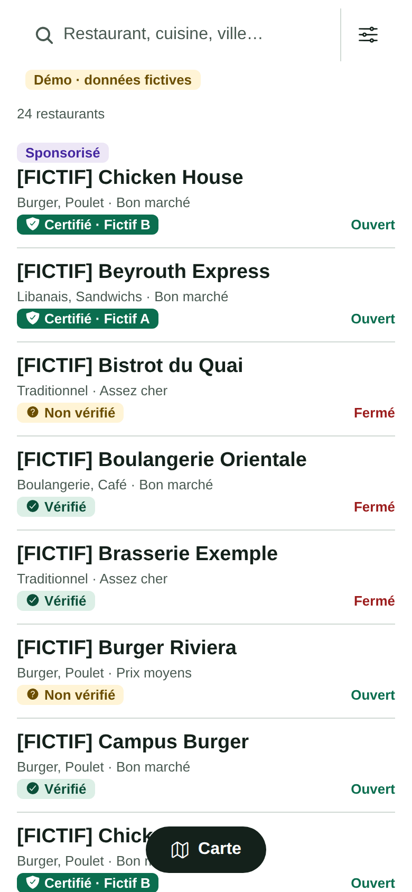
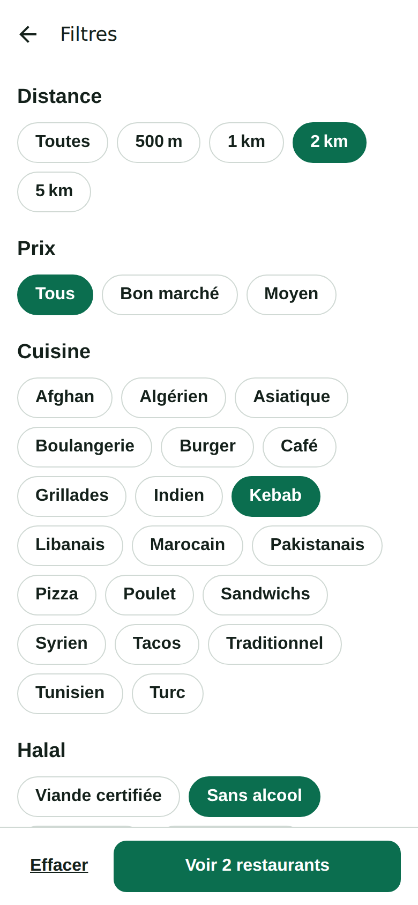
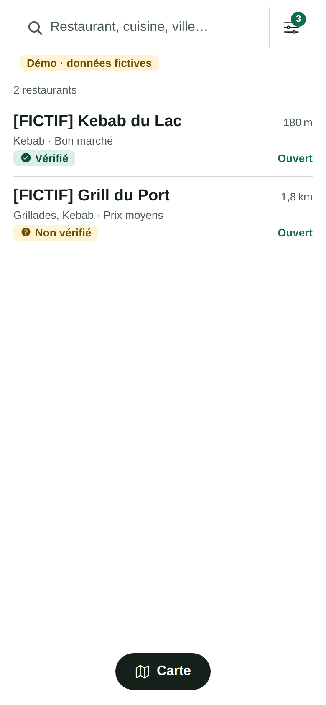

# Phase 2 (en cours) — Carte, recherche et filtres

Date : 04.10.2026 · Branche : `halal-romandie`

Demande : une interface **épurée au maximum**, centrée sur une **carte interactive** et des **filtres** (distance, prix, type de nourriture…).

## Ce qui a été fait

| Écran                       | Contenu                                                                                                                                                                                                                                                                       |
| --------------------------- | ----------------------------------------------------------------------------------------------------------------------------------------------------------------------------------------------------------------------------------------------------------------------------- |
| **Carte** (écran principal) | Carte plein écran (tuiles swisstopo), restaurants regroupés quand on dézoome, barre de recherche flottante, bouton Filtres avec le nombre de filtres actifs, bouton « Me localiser », bouton « Liste ». Toucher un point affiche un aperçu ; toucher l'aperçu ouvre la fiche. |
| **Liste**                   | Même résultats que la carte. Le résultat sponsorisé est en tête, avec l'étiquette « Sponsorisé » ; la liste organique n'est pas modifiée. Distance affichée quand la position est connue.                                                                                     |
| **Filtres**                 | Distance (500 m à 5 km), prix, type de cuisine, critères halal (viande certifiée, sans alcool, 100 % halal, infos vérifiées), ouvert maintenant. Le bouton affiche le nombre de résultats avant d'appliquer.                                                                  |
| **Fiche**                   | Nom, une ligne d'infos, bouton Itinéraire (et Appeler si un numéro existe), bloc halal compact avec icônes, date et source de la vérification, avertissement court, horaires du jour (dépliables), adresse.                                                                   |

Autres changements :

- Textes raccourcis partout (« Sans alcool », « 100 % halal », « Vérifié le … · source »).
- Nom court des organismes de certification (nouvelle migration) : le badge affiche « Certifié · <nom court> », le nom complet reste sur la fiche.
- La position n'est demandée qu'au moment où l'utilisateur appuie sur « Me localiser » ou choisit une distance ; elle n'est ni enregistrée ni envoyée.

## Vérifications

| Vérification                               | Résultat                                           |
| ------------------------------------------ | -------------------------------------------------- |
| Tests (logique, traductions, données, app) | ✅ 108 tests (51 + 14 + 6 + 37)                    |
| Tests base de données (pgTAP)              | ✅ 70 tests, y compris après la nouvelle migration |
| Lint, types, formatage                     | ✅                                                 |
| `expo-doctor`                              | ✅ 21/21                                           |
| Compilation Android (Hermes) et aperçu web | ✅                                                 |

Nouveaux tests de l'écran carte (`apps/mobile/src/lib/explore.test.ts`) : recherche « libanais » en français, tri par distance, filtres combinés, et **un emplacement sponsorisé ne modifie pas la liste organique**.

## Captures (aperçu web, données fictives, position simulée à Vevey)

| Carte                  | Aperçu                   | Fiche                  |
| ---------------------- | ------------------------ | ---------------------- |
|  |  |  |

| Liste                  | Filtres                    | Résultat filtré                        |
| ---------------------- | -------------------------- | -------------------------------------- |
|  |  |  |

## Limites à connaître

- **La carte ne fonctionne pas dans Expo Go** (elle a besoin de code natif). Dans Expo Go, l'app s'ouvre directement en mode liste avec un message. Pour voir la carte sur un téléphone, il faut une _development build_ (voir le README une fois ton matériel connu).
- Les captures viennent de l'aperçu web (mêmes données, même logique, même fond de carte) ; l'aspect sur iPhone et Android sera très proche mais pas identique au pixel.

## Reste à faire dans la phase 2

Photos, carte et prix des plats sur la fiche, et outil d'administration pour créer les fiches (dépend de la décision sur le site web, D10).
